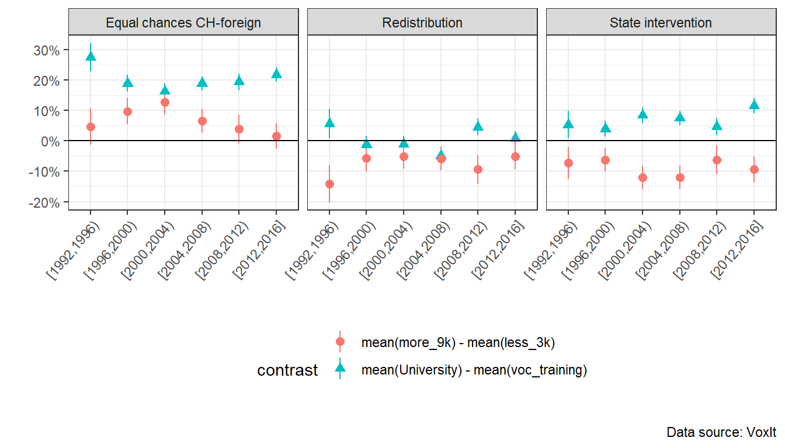

# Présentation thèse de master
Celâl Güney

## Motivation

- Explain and analyze institutional change using Amable and
  Palombarini’s neorealist approach (Amable and Palombarini 2005, 2008,
  2023)

- Switzerland as a case study

<iframe width="100%" height="600" src="docs/The-Political-Economy-of-Institutional-Change-and-Social-Blocs-in-Switzerland--a-Neorealist-Approach.pdf">
</iframe>

## Why Switzerland ?

- Switzerland is often ignored in the theories of political
  economy/comparative capitalism
- Switzerland allows to study stability instead of crisis (France,
  Italy)
- Switzerland is often considered as a very stable and efficient country

## Switzerland and comparative capitalism

- Coordinated market economy (Hall and Soskice 2001)
- Organized capitalism (Charles and Vallet 2024)
- Hybrid model (Trampusch and Mach 2011)

## Institutional change in Switzerland

My notes for this slide on the introduction

## Research question

> What social basis for a neoliberal
> transformation of the Swiss model ?

Research design in three parts

1.  Short history of the Swiss social blocs since 1848, based on the
    literature

- Then, two empirical analyses based on two different approach to social
  blocs

2.  The bi-dimensional “political compass” approach
    - Implicit definition of social blocs, which are pre-defined groups
      based on income and education levels (Piketty 2019) or social
      classes (Oesch and Rennwald 2018)
3.  A multidimensional and bottom-up clustering approach, using latent
    class analysis (Amable 2021)

## Traditional social blocs

<table style="width:100%;">
<colgroup>
<col style="width: 13%" />
<col style="width: 41%" />
<col style="width: 45%" />
</colgroup>
<thead>
<tr class="header">
<th>Social Bloc</th>
<th>Socio-political Groups</th>
<th>Policy Preferences</th>
</tr>
</thead>
<tbody>
<tr class="odd">
<td>Liberal-conservative bloc</td>
<td>
Large industrial, export-oriented and competitive firms, skilled
workers and managers

Medium and small domestic oriented firms, farmers
</td>
<td>
Free-trade, low employment and social protection, low tax
level 
 
 

Public transfers, protection from international competition
</td>
</tr>
<tr class="even">
<td>Left bloc</td>
<td>
Socio-cultural professionals, workers from the public sector

Workers from the private sector
</td>
<td>
State intervention, social protection, increase in real
wage 

Real wage increase, social &amp; employment protection, protection
from international competition
</td>
</tr>
</tbody>
</table>

## Political compass approach

## Political compass approach - WPID

## Hypotheses

1.  *Brahmin left versus merchant right hypotheses*

    - BvsM1. The support for the left and left-wing parties should be
      negatively associated with education and income levels in the
      first time periods. The negative association with education should
      then decrease and become positive over time.
    - BvsM2. The support for the right and right-wing parties should be
      positively associated with education and income in the first time
      periods and the positive association with education should
      decrease over time.

2.  *Bourgeois bloc hypotheses*

    - BB1. The support for redistribution and state intervention should
      decrease with education and income. Support for equal rights
      between Swiss citizen and foreigners should increase with
      education and income.
    - BB2. Support for right-wing parties and the right should increase
      with both income and education levels.

## Results

## Latent Class Analysis

## 12 cluster model

<iframe src="https://jeylal.github.io/selects1999results2/" width="1000" height="600"></iframe>

## References

Amable, Bruno. 2021. “In Search of the Bloc Bourgeois.” *Revue de La
Régulation. Capitalisme, Institutions, Pouvoirs*, no. 31 (August).
<https://doi.org/10.4000/regulation.20350>.

Amable, Bruno, and Stefano Palombarini. 2005. *L’économie Politique
n’est Pas Une Science Morale*. Raisons d’Agir. Paris.

———. 2008. “A Neorealist Approach to Institutional Change and the
Diversity of Capitalism.” *Socio-Economic Review* 7 (1): 123–43.
<https://doi.org/10.1093/ser/mwn018>.

———. 2023. “Multidimensional Social Conflict and Institutional Change.”
*New Political Economy*, May, 1–16.
<https://doi.org/10.1080/13563467.2023.2215701>.

Charles, Léo, and Guillaume Vallet. 2024. “Fast and Curious: ‘The Swiss
Development Puzzle.’ The Institutional Roots of the Success of
Industrialization.” *Review of Political Economy* 0 (0): 1–27.
<https://doi.org/10.1080/09538259.2023.2298747>.

Durrer de la Sota, Carmen, Amory Gethin, and Clara Martinez-Toledano.
2021. “Party System Transformation and the Structure of Political
Cleavages in Austria, Belgium, the Netherlands and Switzerland,
1967-2019.” *World Inequality Lab – Working Paper*, no. 2021.
<https://wid.world/wp-content/uploads/2021/03/WorldInequalityLab_WP2021_08_PoliticalCleavages_AustriaBelgiumNLSwitzerland.pdf>.

Fill, Anna. 2019. *The Political Economy of de-Liberalization: A
Comparative Study on Austria, Germany and Switzerland*. Contributions to
Political Science. Cham: Springer International Publishing.
<https://doi.org/10.1007/978-3-030-01066-9>.

Hall, Peter A., and David Soskice. 2001. *Varieties of Capitalism: The
Institutional Foundations of Comparative Advantage*. Oxford University
Press.

Oesch, Daniel, and Line Rennwald. 2018. “Electoral Competition in
Europe’s New Tripolar Political Space: Class Voting for the Left,
Centre-Right and Radical Right.” *European Journal of Political
Research* 57 (4): 783–807. <https://doi.org/10.1111/1475-6765.12259>.

Piketty, Thomas. 2019. *Capital Et Idéologie*. Le Seuil.

Trampusch, Christine, and André Mach. 2011. *Switzerland in Europe:
Continuity and Change in the Swiss Political Economy*. Taylor & Francis.

